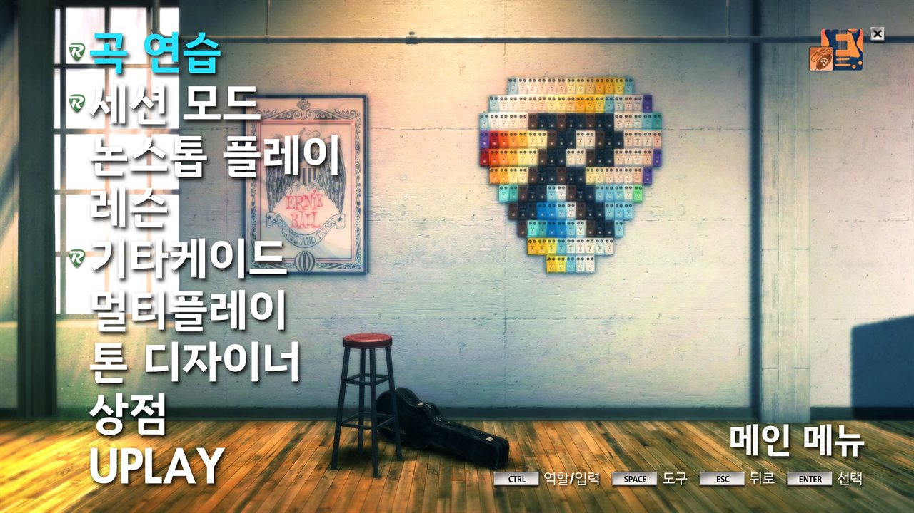
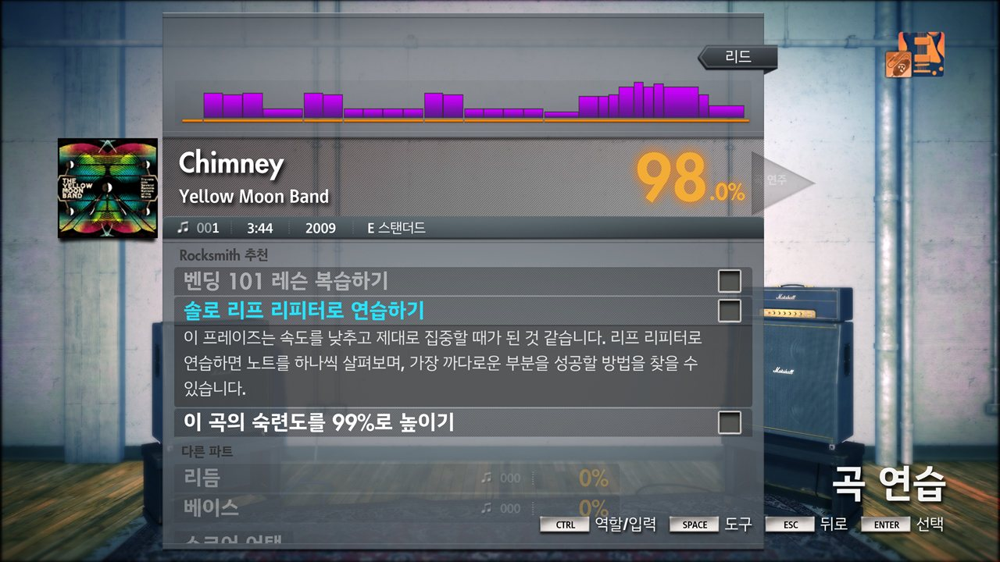
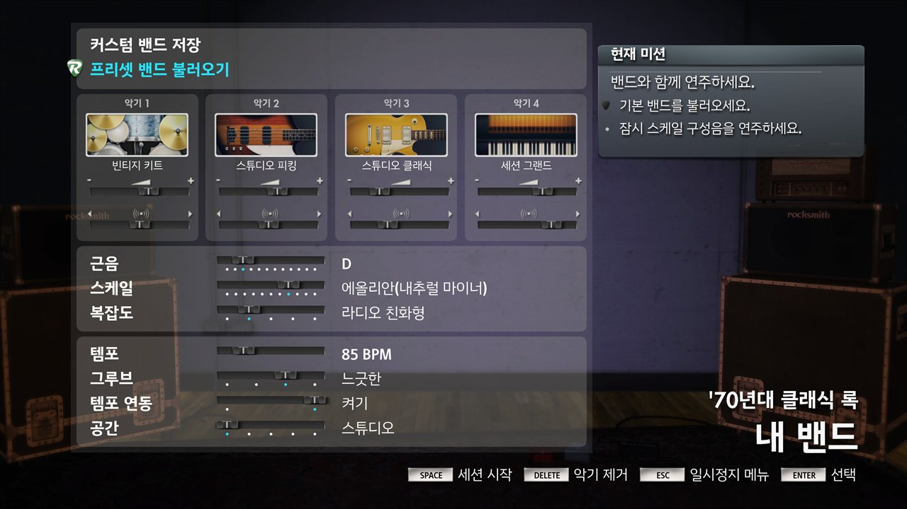
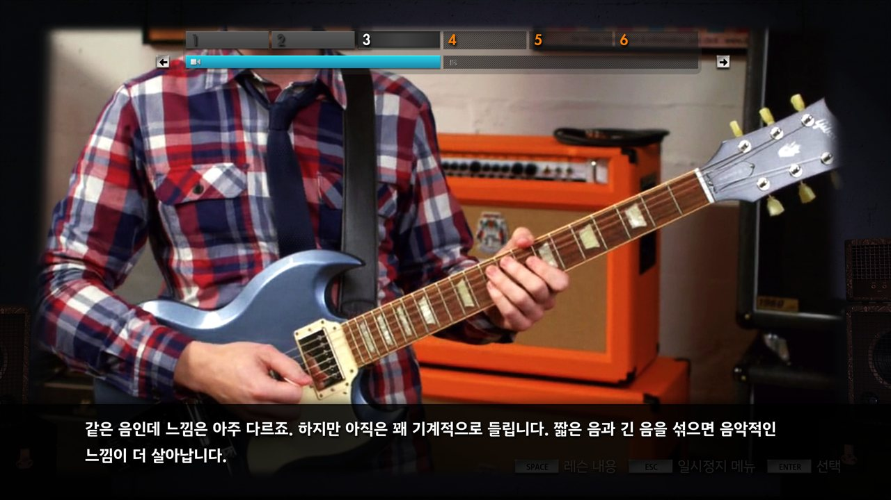
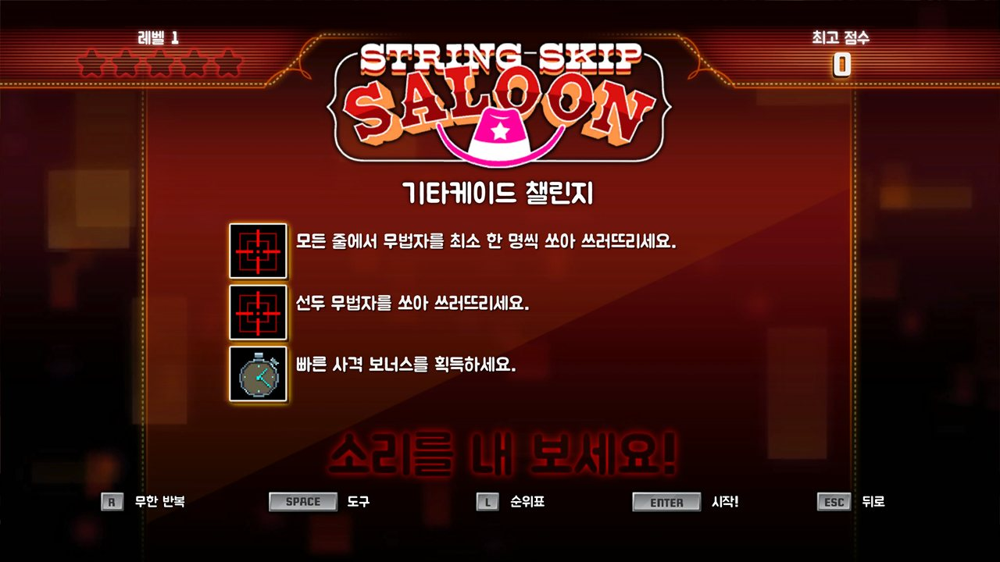
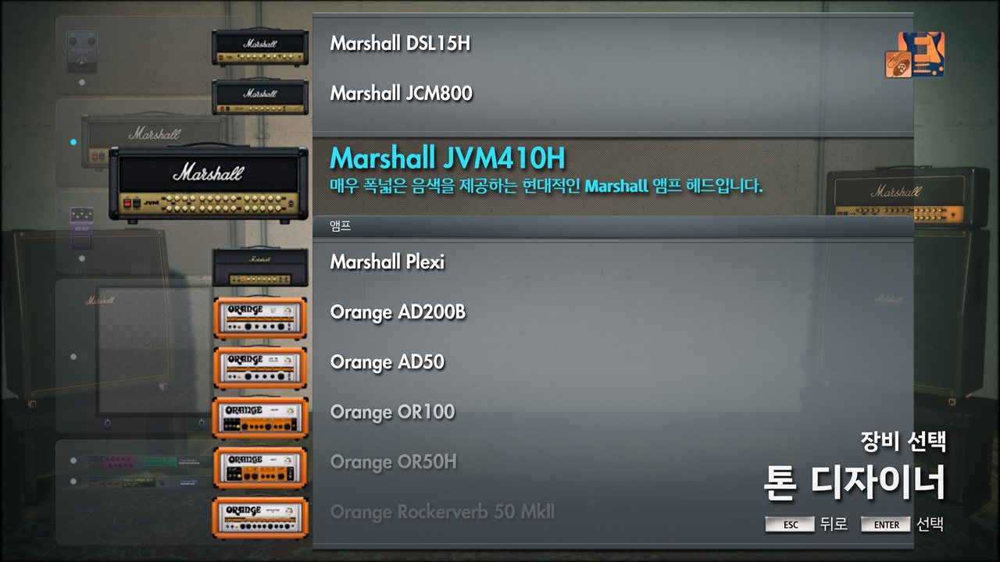

# Rocksmith 2014 한국어 패치

[Rocksmith 2014 Remastered](https://store.steampowered.com/app/221680/Rocksmith_2014_Edition_REMASTERED_LEARN__PLAY/)의 비공식 한국어 패치입니다.

  
  
   
  
  
   
  
  

## 다운로드

[다운로드 링크](https://github.com/gszzzzzz/rs2014kor/releases/latest)에서 최신 버전을 받을 수 있습니다.

- Windows: `rs2014kor-windows.zip`
- macOS: `rs2014kor-macos.zip`

Windows와 macOS 파일은 서로 호환되지 않으므로, 각 운영체제에 맞는 압축 파일을 사용하세요.

## 설치

1. Rocksmith 2014가 실행 중이라면, 먼저 종료합니다.
2. Rocksmith 2014 설치 폴더를 엽니다.
3. 설치 폴더 안의 `cache.psarc` 파일을 안전한 경로에 백업합니다.
4. 다운로드한 ZIP 파일의 압축을 풀고, 그 안의 `cache.psarc` 파일만 설치 폴더에 복사합니다. 기존 파일을 덮어쓰게 됩니다.
5. 게임을 다시 실행하고 패치가 적용되었는지 확인합니다.

## 제거 및 원본 복구

1. Rocksmith 2014가 실행 중이라면, 먼저 종료합니다.
2. Rocksmith 2014 설치 폴더를 엽니다.
3. 백업해 둔 `cache.psarc` 파일을 설치 폴더에 복사합니다. 기존 파일을 덮어쓰게 됩니다.
4. 게임을 다시 실행하고 원본 상태로 복구되었는지 확인합니다.

만약 백업해 둔 파일이 없다면, Steam 클라이언트를 통해 원본으로 복구할 수 있습니다:

1. Steam에서 Rocksmith 2014를 우클릭합니다.
2. **속성 > 설치된 파일**로 이동합니다.
3. **게임 파일 무결성 검사** 버튼을 눌러 복구를 진행합니다.

## 오류 제보

오역, 문맥에 맞지 않는 번역, 잘린 문구 또는 그 외 오류를 발견하신 경우,
[이슈 페이지](https://github.com/gszzzzzz/rs2014kor/issues)에 제보해 주세요.

## 참고사항

- 한국어 글꼴은 [IBM Plex Sans](https://fonts.google.com/specimen/IBM+Plex+Sans)와 [주아체](https://noonnu.cc/font_page/53)를 사용하며, 영문과 숫자는 게임의 원본 글꼴을 유지합니다.
- 이 패치는 Steam 빌드 16576867(2024-12-20)을 기준으로 제작되었습니다.
- 이 패치는 비공식·비상업적 팬 번역이며, Ubisoft의 공식 지원을 받지 않습니다.
- Rocksmith와 Rocksmith 2014, 관련 상표 그리고 게임 자산에 대한 권리는 Ubisoft 및 각 권리자에게 있습니다.
